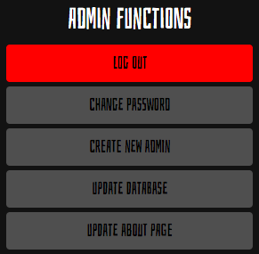
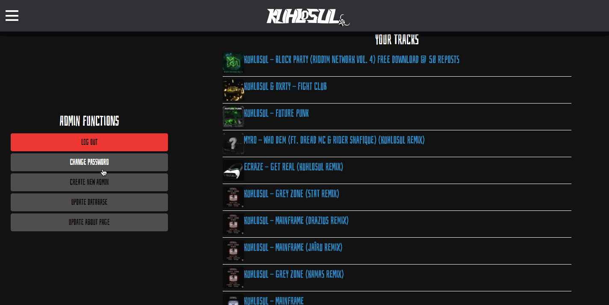

# Kuhlosul App

[](https://creativecommons.org/licenses/by-nc-nd/4.0/)
[]()
[]()


## Table of Contents

<hr>

- [Core Technologies](#core-technologies)
- [Various Packages Used](#various-packages-used)
- [Custom ScScraper Library](#scscraper)
- [Mongoose Models](#models)
- [updateDb Function](#update-db)
- [GraphQL Mutations and Queries](#graphql)
- [JWT](#jwt)
- [Utilizing React's Context API](#usecontext)
- [Nodemailer Contact Form](#nodemailer)
- [Rate-Limiting the API](#rate-limit)
- [Custom Reusabale Components with Rebass](#custom-components)
- [Modals with Bootstrap](#modals)
<!-- - [Extra Security Measures](#extra-security) -->
- [Credits](#credits)
- [License](#license)

## About

The official artist page for my best friend and upcoming DJ/producer [Kuhlosul](https://soundcloud.com/k_dubs). This MERNG PWA includes a standard "About" page, a "Tracks" page, and a "Contact" page. There is also an admin panel which allows admins to complete various tasks such as editing the content on the About page, and updating the database with Kuhlosul's latest tracks (pulled from SoundCloud).

<hr>
<h2><a href='https://kuhlosul-app.herokuapp.com/'>Deployed Production Build</a></h2>
<hr>

<h2 id='core-technologies'>Core Technologies</h2>
<hr>

- [React](https://reactjs.org/)
- [NodeJS](https://nodejs.org/en/)
- [ExpressJS](https://expressjs.com/)
- [MongoDB](https://www.mongodb.com/)
- [GraphQL](https://graphql.org/)
- [Apollo](https://www.apollographql.com/)
- [JWT](https://jwt.io/)
- [Puppeteer](https://pptr.dev/)
- [Cheerio](https://cheerio.js.org/)

<h2 id='various-packages-used'>Various Packages Used</h2>
<hr>

(Not all listed here)

### NodeJS

- [apollo-server-express](https://www.npmjs.com/package/apollo-server-express)
- [axios](https://www.npmjs.com/package/axios)
- [bcrypt](https://www.npmjs.com/package/bcrypt)
- [compression](https://www.npmjs.com/package/compression)
- [express-rate-limit](https://www.npmjs.com/package/express-rate-limit)
- [express-slow-down](https://www.npmjs.com/package/express-slow-down)
- [helmet](https://www.npmjs.com/package/helmet)
- [mongoose](https://www.npmjs.com/package/mongoose)
- [nodemailer](https://www.npmjs.com/package/nodemailer)

### React

- [jwt-decode](https://www.npmjs.com/package/jwt-decode)
- [rebass](https://www.npmjs.com/package/rebass)
- [react-bootstrap](https://www.npmjs.com/package/react-bootstrap)
- [react-router-dom](https://www.npmjs.com/package/react-router-dom)
- [uuidv4](https://www.npmjs.com/package/uuidv4)

<h2 id='scscraper'>ScScraper</h2>
<hr>

The ScScraper library is a small library specifically created for this application which can scrape data about a SoundCloud user, their tracks, and their tracks which have been posted to different accounts and added to their 'Playlists' page (this is the most popular method of making one's tracks posted elsewhere still show up on their main SoundCloud page).

The [soundcloud-scraper](https://www.npmjs.com/package/soundcloud-scraper) library is slightly utilized for some of the methods within the ScScraper library; however, the vast majority of the logic is 100% custom.

ScScraper's roots lie in two very specific helper functions:

1. **loadProfileBody**

This function takes in a SoundCloud username and a page on which to run the scrape. It utilized Puppeteer, and returns the HTML of the page based on the parameters specified.

2. **autoScroll**

Used within the 'loadProfileBody' function, this asynchronous call simply scrolls to the bottom of the page before allowing the loadProfileBody function to return its final value of raw HTML.

<hr>

These two functions are used notoriously within the actual ScScraper class methods. The return value of the loadProfileBody is then parsed and formatted into usable JSON content.

### In action:

```JavaScript
getTracks = async function (username, query = 'tracks', headless) {
  try {
    const body = await loadProfileBody(username, query, headless);

    const $ = cheerio.load(body);

    const tracks = [];

    $('.sound__body').each((_i, elem) => {
      const sound = {
        title: $(elem).find('.soundTitle__title > span').text().trim(),
        url:
          'https://soundcloud.com' +
          $(elem).find('.soundTitle__title').attr('href'),
      };
      tracks.push(sound);
    });
    return tracks;
  } catch (err) {
    throw new Error('Failed to pull tracks.');
  }
};
```

<h2 id='models'>Mongoose Models</h2>
<hr>

The small database of this app has three main models:

1. **Admin**
2. **Track**
3. **AboutPage**

They are quite self-explanatory based on name alone. Most of the initial server-side work was done with the 'tracks' MongoDB collection.

The overall goal is to serve the end-user a list of tracks on the webpage. The problem is that scraping SoundCloud every time the user makes a request is extremely slow and inefficient due to the need to autoScroll each page before scraping it. Because of this, I decided to store the scraped tracks in a MongoDB database.

Because the data coming from ScScraper was more than necessary to fulfill Kuhlosul's vision of this app, I created a simplistic model for a Track:

```JavaScript
const trackSchema = new Schema({
  title: {
    type: String,
  },
  thumbnail: {
    type: String,
  },
  url: {
    type: String,
  },
  genre: {
    type: String,
  },
  publishedAt: {
    type: Date,
  },
});
```

<h2 id='update-db'>updateDb Function</h2>
<hr>

The updateDb function is a single asynchronous function which clears the tracks collection within the Db, scrapes SoundCloud for the freshest data, then creates a document within the 'tracks' collection for every single track.

With this function, we can utilize all of our app's server-side foundation logic in three lines of code:

```JavaScript
const runUpdate = async() => {
  const added = await updateDb();
  return added; // Returns a Tracks.find({})
};
```

Within the server.js file, this function is set on a setInterval. It automatically runs in the background every 12 hours to ensure the database is always up-to-date.

<h2 id='graphql'>GraphQL Mutations and Queries</h2>
<hr>

This application uses GraphQL entirely. I did create a 'routes' folder when initially creating the project, as I was considering having a hybrid of RESTful routes and GraphQL routes; however, I decided that would become messy and difficult to maintain.

There are 3 main queries, and 6 main mutations at the moment. This number will increase as updates roll out:

```JavaScript
type Query {
  tracks: [Track]
  viewdashboard: AdminCheck
  getAbout: About
}

type Mutation {
  login(email: String!, password: String!): Auth
  seed: [Track]
  changePassword(password: String!): Admin
  createAdmin(email: String!, password: String!): Admin
  updateAbout(header: String!, body: String!): About
  sendMessage(
    email: String!
    type: String!
    subject: String!
    body: String!
  ): Status
}
```

The 'seed' mutation is the one which is used to manually run the [updateDb function](#update-db) from the admin dashboard:



<h2 id='jwt'>JWT</h2>
<hr>

### Server-Side

Two methods are used within the auth.js file of the server's utils folder in order to handle server-side authentication:

1. **signToken**

This method takes in an 'Admin' object from our database, creates and signs a new token, and returns an object including the '\_id', 'email', and the newly created web token. Because there is no ability for users to create accounts (except for admins creating new admin accounts), this method is only used in one place - the 'login' mutation resolver:

```JavaScript
login: async (parent, { email, password }) => {
  email = email.toLowerCase()
  // grab the admin corresponding to the email sent in the request
  const admin = await Admin.findOne({ email });

  if (!admin) return new Error('No admin with this email found!');

  // verify if the password is correct using custom Mongoose hook utilizing bcrypt
  const correctPass = await admin.checkPassword(password);

  if (!correctPass) return new AuthenticationError('Incorrect passoword!');

  // create the 'Auth' object by passing our admin object into the signToken function
  const token = signToken(admin);

  // return the token object and the admin object
  return { token, admin };
},
```

In order to accommodate for the return of this resolver, it was necessary to create an 'Auth' type within my GraphQL typeDefs:

```JavaScript
type Auth {
  token: ID!
  admin: Admin
}
```

The token is set up to expire after 24 hours.

2. **authMiddleware**

The authMiddleware method allows us to receive our token initially signed with signToken from the client. I decided to make it very flexible when writing it, and set it up to where the token can be placed in the request's body, query, or headers. Eventually I placed it in the headers.

After being pulled from the request, the JWT is then verified, and the decoded data is added to the request object to be used within our GraphQL context.

Adding the authMiddleware function to the ApolloServer:

```JavaScript
const server = new ApolloServer({
  typeDefs,
  resolvers,
  context: authMiddleware,
});
```

Using the context within a resolver:

```JavaScript
changePassword: async (parent, { password }, context) => {
  // if no admin object within context, return custom error
  if (!context.admin)
    return new AuthenticationError('Failed to authenticate Admin');

  // find the admin with the context.admin's _id and change the password
  const withNewPassword = await Admin.findOneAndUpdate(
    { _id: context.admin._id },
    { password: password },
    { new: true }
  );
  return withNewPassword;
},
```

### Client-Side

Utilizing JWT decode, I created a custom class containing all of the necessary methods to handle client-side authentication, and exported it to be available to all of the app's components.

There are 6 total methods on this class:

1. **login**

Takes a token as an argument. Adds the token to sessionStorage, then redirects the user to the dashboard.

2. **logout**

Removes the token from sessionStorage and redirects the user to the homepage.

3. **getToken**

Pulls the token from sessionStorage and returns it. This method is more of a helper method, as it is only used within the class itself, and not within any components.

4. **getProfile**

Returns the decoded return value of the getToken method.

5. **isTokenExpired**

Takes a token as an argument, compares its expiration date to the current date, then returns a boolean based on whether or not it's expired.

6. **loggedIn**

Retrieves the existing token from sessionStorage, and returns a boolean based on whether or not the token exists, and whether or not it is expired (utilizing the isTokenExpired method).

Example the login method in use:

```JavaScript
import Auth from '../../utils/auth';

const handleSubmit = async (e) => {
  e.preventDefault();
  try {
    // Run our login GraphQL mutation, then run the login method
    const { data } = await login({
      variables: { ...formValues },
    });

    Auth.login(data.login.token);

    setFormValues({
      email: '',
      password: '',
    });
  } catch (err) {
    alert('There was an error logging in');
  }
};
```

Example of the loggedIn method in use:

```JavaScript
// If the user is not logged in based on our checks, this link goes to the /login page
// Otherwise, it goes to the /dashboard page
<Link
  to={Auth.loggedIn() ? '/dashboard' : '/login'}
  style={{ height: '1.5rem', cursor: 'pointer' }}
>
  <p style={{ fontSize: '1.5rem', cursor: 'pointer' }}>
    Admin Dashboard
  </p>
</Link>
```

<h2 id='usecontext'>Utilizing React's Context API</h2>
<hr>

For a while, I was debating with myself on whether or not to use Redux, or Context API. Though I have experience with both, I eventually settled on the more modern technology - the useContext hook.

I created separate files for actions, reducers, and the context provider itself. At the moment, there is only one action; however, this will surely change in the future, and I am glad to have set this up early-on in the app's development.

'GlobalProvider.js' exports two main things:

1. **Custom 'useGlobalContext' hook**

This removes the need to import 'useContext' every time the GlobalContext is needed.

2. **GlobalProvider**

A stateful component which uses our reducer function defined in 'reducers.js'. A context provider is returned with the values being the current state of the useReducer, and the useReducer's dispatch function. Like the first export, this eliminates the need to import 'useReducer', as well as our reducer function, every time we want to mutate the global state.

We can see our global context in action within the 'Dropdown.js' component:

```JavaScript
const { currentPage, dispatch } = useGlobalContext();

const handleItemClick = ({ target }) => {
  if (target.id !== currentPage) window.scrollTo(0, 0);
  dispatch({
    type: SET_CURRENT_PAGE,
    payload: target.id,
  });
};
```

<h2 id='nodemailer'>Nodemailer Contact Form</h2>
<hr>

One of Kuhlosul's visions for the application was to send the message from the contact form to a different email based on the type of message being sent. He has an email for general inquiries, and a separate one for promo emails. The logic for this functionality was handled entirely on the server-side. The request contains the form's information, which includes the value of the dropdown; therefore, a simple ternary operator was able to handle everything:

```JavaScript
sendMessage: async (parent, { email, type, subject, body }) => {
  try {
    const to =
      type === 'Promos' ? process.env.PROMO_EMAIL : process.env.MAIN_EMAIL;
// ...
```

The [nodemailer](https://www.npmjs.com/package/nodemailer) package made it fairly easy to handle the sendMessage request. I created a NoReply [Outlook](https://outlook.com) account, and used its credentials within the Nodemailer transporter. The documentation was wildly helpful in finding out exactly which options needed to be used in order to properly connect to and authenticate on various different types of SMTP servers.

<h2 id='rate-limit'>Rate-Limiting the API</h2>
<hr>

### Client-Side "Rate-Limiting"

After creating the contact form, I immediately realized that some rate limiting was in order to prevent the potential abuse of the site. On the client-side, specifically for the contact form, I created a class with just two main methods.

1. **saveSentTime**

Saves an item in sessionStorage including the current date and time.

2. **canSend**

Compares the current date to the date saved in sessionStorage. If the difference between the two is greater than or equal to a single day, return true.

Though it's nifty, this client-side-only solution is not very secure, and does not prevent the user from spamming the living daylights out of the server.

### Server-Side Rate and Speed Limiting

Using [express-rate-limit](https://www.npmjs.com/package/express-rate-limit) and [express-slow-down](https://www.npmjs.com/package/express-slow-down) made it an extremely process to set up rate-limiting for all requests to the server:

```JavaScript
const rateLimiter = new RateLimit({
  // Store rateLimit information within the database
  store: new MongoStore({
    uri: process.env.MONGODB_URI || 'mongodb://localhost/masondb',
    // Every 10 minutes, reset back to 0
    expireTimeMs: 10 * 60 * 1000,
    errorHandler: console.error.bind(null, 'rate-limit-mongo'),
    statusCode: 429,
  }),
  // Maximum requests === 1000
  max: 1000,
  // Every 10 minutes,
  windowMs: 10 * 60 * 1000,
});

const speedLimiter = SpeedLimit({
  // Every 10 minutes,
  windowMs: 10 * 60 * 1000,
  // Begin delaying requests after the 600 cap has been reached within 10 minutes
  delayAfter: 600,
  // Delay each request thereafter by 300ms
  delayMs: 300,
});
```

<h2 id='custom-components'>Custom Reusabale Components with Rebass</h2>
<hr>

Though Rebass is a great library of components as is, I realize that best practice is to create custom components which can later be modified to support a different dependency if needed. Because of this, some of this app's most reused components are custom components built (mostly) with Rebass components.

Example of the 'KInput.js' component:

```JavaScript
export default function KInput({
  id,
  label,
  labelColor,
  type,
  placeholder,
  onChange,
  color = 'white',
  ...props
}) {
  return (
    <Box style={{ width: '100%', minWidth: '200px', maxWidth: '1000px' }}>
      <Label htmlFor={id} style={{ color: labelColor, fontStyle: 'italic' }}>
        {label}
      </Label>
      <Input
        id={id}
        name={type}
        type={type}
        placeholder={placeholder}
        style={{ color: color }}
        onChange={onChange}
        {...props}
      />
    </Box>
  );
}
```

<h2 id='modals'>Modals with Bootstrap</h2>
<hr>

Bootstrap modal components within React are among some of the easier ones to work with, and streamlined the creation of the admin dashboard. All functions on the dashboard are done through/confirmed through a Bootstrap modal.



<h2 id='credits'>Credits</h2>
<hr>

**Matt Stephens**

- [Portfolio](https://mstephen19.github.io/newestPortfolio)
- [Github](https://github.com/mstephen19)
- [LinkedIn](https://www.linkedin.com/mstephen19)

<h2 id='license'>License</h2>
<hr>

This project is protected by a [Creative Commons Attribution-NonCommercial-NoDerivatives 4.0 International License](https://creativecommons.org/licenses/by-nc-nd/4.0/)
